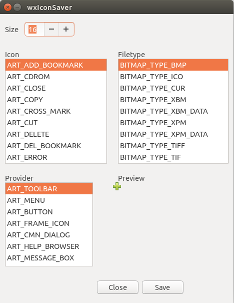
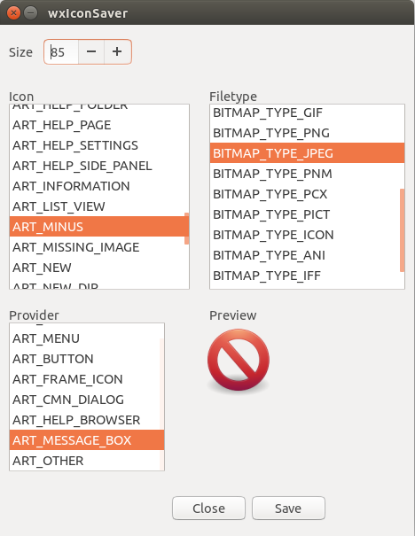

========
Usage
========

The main window of ``wxIconSaver`` is shown below.

	The main window

The Icon, Filetype, Provider and Size can all be customised.

	Selecting a different Icon, Filetype, Provider and Size.

.. tip::

	Try to use standard image sizes (e.g, 32, 48, 46, 128), as other sizes can be blurry.

To save the icon, click the :guilabel:`Save` button.
